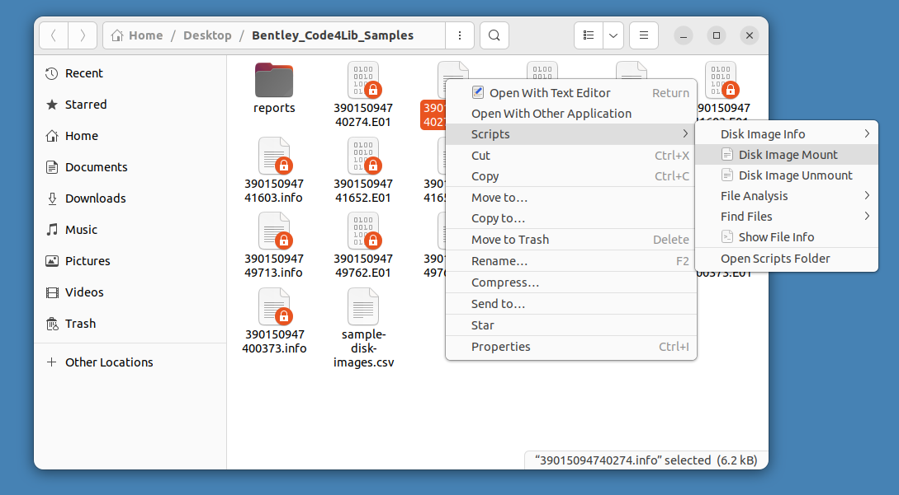

:::::::::::::::::::::::::::::::::::::: questions 

- What is a disk image?
- When would you disk image media?

::::::::::::::::::::::::::::::::::::::::::::::::

::::::::::::::::::::::::::::::::::::: objectives

- Use the Guymager disk imaging software to acquire the contents of a storage device and its associated metadata.
- Learn to evaluate when to image a disk based on individualized criteria. 
::::::::::::::::::::::::::::::::::::::::::::::::

## What is a Disk Image?

A **disk image** a bit-perfect sequence of all the bits on a particular physical device; in other words, a complete bitstream (as defined by the physical limits of a storage device).

  - You may have seen .dmg, or .iso files - these are images (like a thumb drive, CD, diskette)
  - We will work with “forensic images,” specifically the “Expert Witness” format (aka .E01 or EWF), which is a complete sequence of a physical drive, does not allow any modifications  

## To image or not to image?
### Considerations for disk imaging

There is no right or wrong answer to whether or not you should image a disk! 

- Are you choosing between extracting files and/or chunks of content?
- Collection considerations: 
  - What is your collecting purpose? 
  - What is the role of the device(s)?
  - What are you storage concerns?
- Device considerations:
  - What devices have an OS (that means lots of redundant & proprietary files)? 
  - If it’s a storage device, may have deleted/unintended files (these are captured by forensic imaging approaches)
  - What is on the device? Sometimes the device contents will determine if a disk image is required, such as executable files or other software.
  - What are the preservation needs?
  

## Creating a disk image

For this walk through we will be using 3.25 inch floppy disks. Similar concepts are applicable to other storage mediums, but the exact steps may differ.

### Using Guymager

*The following instructions are modified from the* [Bitcurator Quick Start Guide](https://github.com/BitCurator/bitcurator-distro/wiki/BitCurator-Quick-Start-Guide#mounting-and-examining-a-disk-image)

Mounting the device is not required to create an image of it. If you wish to mount the device, click on the Files icon in the dock, and select the name of the indicated volume on the device to mount. If you are not using a hardware write blocker, or if the USB device read-only policy is not enabled, your device is now mounted and writable.

Click on the **Applications** menu in the top left of the screen, then navigate to the Imaging and Recovery submenu. Then click on Guymager. Guymager requires elevated privileges for access to physical devices; you will be prompted for your password to enable this. Once Guymager has loaded, the main interface appears as in the picture above. In this example, the 3.25 inch floppy disk drive is selected.

Next, right-click on the selected device (in this example, a 3.25 USB floppy drive listed as MITSUMI_USB_FDD) and select **Acquire Image** from the context menu.

A new dialog prompt will appear. This disk image will be acquired using the Expert Witness Format (the second option at the top). Guymager will split EWF images into 2048MiB segments by default. If you do not wish to split the image, set the **Split size** to something very large (2 EiB, for example).

The five metadata fields starting with **Batch number** are optional, but can be useful for tracking and metadata purposes. Under **Destination** select the image directory you would like the disk image to be saved to. In this case, we have simply chosen to write the image to a folder on the Desktop. Finally, provide a name for the image. Then click **Start**.

You will see the main dialog state change to **Running**. When the acquisition finishes, you will see a **Finished - Verified & Ok** message in the State column.

#### Some disk image formats you may see
- RAW and Split RAW (RAW stored across multiple files)
- Advanced Forensics Format (AFF) [no longer recommended]
- EnCase Evidence File (.E01)
- ISO (for CD-ROM)
- IMG (floppy or sometimes CD-ROM)

##### RAW format (dd)
- Copies of the raw media data. Often split into smaller chunks to make them more  manageable and so that the resulting images can fit onto limited file systems and  media such as FAT or DVD/CDROM.
- Advantages:
  - Very simple, use simple tools to manipulate the image.
  - Image can be easily split for storage and transport on removable media
  - Output can be piped to other applications for immediate processing
- Disadvantages:
  - Can be very large (no compression). Zipped raw images cannot be  operated on directly with regular tools (efficiently perform arbitrary seeks).
  - Often too large to store on FAT formatted media
  - No metadata other than file names, no hashes.
  - No checksumming on files – not robust
  - Missing segments (for example from scratched CD/DVD – can  sometimes be overwritten with 0’s).
  - Overwritten data (unrecoverable – no checksums on small blocks in  file).
  
##### Expert Witness Format (EnCase)
- Evidence file consists (in order) of: Acquisition information, Data Block, CRC (cyclic redundancy check), acquisition hash (MD5)
- Can be split for storage, transport
- CRC computed for every 32K block; balance between integrity and  speed, also makes it very difficult to tamper with the evidence file (1 in 4 billion chance of collision)
- Cannot be manipulated with simple (open source UNIX) tools; support  reverse engineered in libewf
- Previously limited to 2GB size
- Largely proprietary
- Has been reverse engineered by Joachim Metz in [libewf](http://sourceforge.net/projects/libewf/files/) (used in open source tools that read EWF) - 

##### ISO (.img) for CD-ROM, DVD
- Similar to raw, but can’t contain 
  - multiple tracks
  - audio or video tracks
- Doesn’t contain control headers or error correction fields (raw can include these)
- Filesystem usually will be either ISO 9660 (CD-ROM) or UDF (DVDs)

## Accessing Disk Images

- Virtualization and emulation
- Mounting the original filesystem
- Accessing (but not mounting) disk images using forensics software
- For end user access:
  - Remote, dynamic access to disk image contents (via server, virtual environment)
  - Cross-drive analysis

### Mount disk image: Using BitCurator Mounter

*The following instructions are modified from the* [Bitcurator Quick Start Guide](https://github.com/BitCurator/bitcurator-distro/wiki/BitCurator-Quick-Start-Guide#mounting-and-examining-a-disk-image)

In the file manager dialog, right click on any of the sample images you have created, select **Scripts**, and then select **Disk Image Mount**. This script serves as a wrapper for libewf and some mounting tools to attempt to automatically mount any identified file systems. If such a filesystem is found, you will see it appear as a mountable device in the list on the left.

Note: This mount is read-only. You cannot alter the content of a filesystem mounted from an E01 file (modifying, adding new files, or deleting) from this desktop interface.

Once you have finished examining the content, click the eject indicator next to the filesystem name in the file dialog. You will get a prompt for your user password in order to complete this step.

  
####Do it Yourself!

::::::::::::::::::::::::::::::::::::: Activity 

Split into two groups.

Group 1: Create your own disk images from the supplied 3.25 inch floppy disks.

Group 2: Mount one of the sample disk images available in the [GitHub repo](https://github.com/BitCurator/bcc-dfa-sample-data). What information do you see? Is there anything that sticks out to you? 

::::::::::::::::::::::::::::::::::::::::::::::::

::::::::::::::::::::::::::::::::::::: keypoints 

- Digital forensic approaches can offer useful tools to digital curators in working with legacy removable media
- Important concepts include thinking beyond the file level and disk imaging
- BitCurator environment offers a useful bundle of tools that are of use to digital curators

::::::::::::::::::::::::::::::::::::::::::::::::

